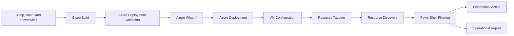

# Azure Infrastructure and Operations Toolkit

<p align="center">
  
  
  
  
  
  
  
</p>

<p align="center">
  
  
  
  
  
  
</p>

<p align="center">
  A modular Azure Infrastructure as Code and cloud operations laboratory built with Bicep, PowerShell, Azure CLI, Linux, Azure Monitor, and GitHub Actions.
</p>

<p align="center">
  <a href="https://github.com/NatoRodrigues/iaac-az/actions/workflows/deploy.yml">
    
  </a>
</p>

---

## Overview

This project demonstrates the complete lifecycle of an Azure environment, from infrastructure provisioning and validation to monitoring, governance, cost optimization, and controlled operational actions.

The solution combines declarative Infrastructure as Code with practical automation for three operational domains:

- **DayOps:** inventory, visibility, tagging, and lifecycle operations
- **FinOps:** power-state control, cost reporting, and idle-resource discovery
- **SecOps:** secure VM command execution and tag-driven backup operations

The environment contains separate development and production workloads connected through bidirectional VNet peering. It also includes intentionally orphaned resources for safe FinOps and cloud hygiene testing.

---

## Project Goals

- Provision repeatable Azure infrastructure with Bicep
- Organize infrastructure into reusable Bicep modules
- Validate Bash scripts and Bicep templates before deployment
- Preview infrastructure changes with Azure What-If
- Automate deployments with GitHub Actions
- Configure Linux VMs with Custom Script Extensions
- Apply tag-based governance across cloud resources
- Inspect compute, networking, storage, and monitoring configuration
- Generate detailed VM inventory reports
- Identify unattached and unassociated Azure resources
- Provide basic cost visibility by resource and operational metadata
- Safely start, stop, and deallocate eligible virtual machines
- Execute VM commands without public IP addresses or open SSH ports
- Audit and enable VM backup based on governance tags
- Apply least-privilege and secret-management practices

---

## Architecture

<p align="center">
  
</p>

### Architecture Summary

```text
Resource Group: rg-renato
Region: East US

├── Network
│   ├── vnet-dev (10.0.0.0/16)
│   │   ├── subnet-dev (10.0.1.0/24)
│   │   ├── nsg-dev
│   │   └── peering to vnet-prod
│   │
│   └── vnet-prod (10.1.0.0/16)
│       ├── subnet-prod (10.1.1.0/24)
│       ├── nsg-prod
│       └── peering to vnet-dev
│
├── Compute
│   ├── vm-dev
│   │   ├── nic-dev
│   │   ├── private IP: 10.0.1.4
│   │   ├── Standard_B1s
│   │   └── Custom Script Extension
│   │
│   └── vm-prod
│       ├── nic-prod
│       ├── private IP: 10.1.1.4
│       ├── Standard_B1s
│       └── Custom Script Extension
│
├── Monitoring
│   ├── Development VM metric alert
│   ├── Production VM metric alert
│   └── Shared Action Group
│
├── Storage
│   └── Storage account
│
└── Orphan Resource Laboratory
    ├── Unattached managed disk
    └── Unassociated public IP address
```

### Solution Flow



---

## Technology Stack

| Area | Technologies |
|---|---|
| Cloud platform | Microsoft Azure |
| Infrastructure as Code | Azure Bicep |
| Automation | PowerShell 7, Azure CLI, Bash |
| CI/CD | GitHub Actions |
| Compute | Azure Linux Virtual Machines |
| Networking | VNets, subnets, NICs, NSGs, VNet peering |
| Monitoring | Azure Monitor metric alerts and Action Groups |
| Storage | Azure Storage and managed disks |
| Identity | Microsoft Entra ID Service Principal |
| Operations | DayOps, FinOps, and SecOps tooling |
| Governance | Azure tags and least-privilege RBAC |

---

## Repository Structure

```text
iaac-az/
├── .github/
│   └── workflows/
│       └── deploy.yml
│
├── docs/
│   └── architecture.md
│
├── IaC/
│   ├── modules/
│   │   ├── compute.bicep
│   │   ├── monitoring.bicep
│   │   ├── network.bicep
│   │   ├── orphans.bicep
│   │   ├── storage.bicep
│   │   └── vm.bicep
│   │
│   ├── scripts/
│   │   ├── setup-dev.sh
│   │   └── setup-prod.sh
│   │
│   ├── main.bicep
│   └── variables.bicep
│
├── ops-toolkit/
│   ├── dayops/
│   │   ├── Get-AzVMInventory.ps1
│   │   ├── Set-AzTagScheduler.ps1
│   │   └── Watch-AzVMInventory.ps1
│   │
│   ├── finops/
│   │   ├── Find-AzIdleResources.ps1
│   │   ├── Get-AzCostReport.ps1
│   │   └── Set-AzVMPowerState.ps1
│   │
│   └── secops/
│       ├── Invoke-AzSecureCommand.ps1
│       └── Start-AzVMBackup.ps1
│
├── .gitignore
├── commands.md
└── README.md
```

Local secrets, generated reports, logs, and compiled templates should be excluded through `.gitignore`:

```gitignore
.env
*.log
*.csv
IaC/*.json
```

---

## Infrastructure as Code

### Modular Bicep Design

`main.bicep` is the resource group deployment entry point and coordinates the infrastructure modules:

```text
main.bicep
├── network.bicep
├── compute.bicep
│   └── vm.bicep
├── storage.bicep
├── orphans.bicep
└── monitoring.bicep
```

This design separates responsibilities, reduces duplication, and makes each workload easier to maintain and extend.

### `main.bicep`

The entry point:

- Accepts global deployment parameters
- Deploys the networking module
- Passes subnet resource IDs to the compute module
- Deploys storage and orphan-resource modules
- Passes VM resource IDs to the monitoring module
- Connects module parameters, outputs, and dependencies

Example parameters:

```bicep
@description('Email address that receives Azure Monitor alerts.')
param alertEmail string

@secure()
param adminPassword string

param adminUsername string = 'azureuser'
param location string = resourceGroup().location
```

### `variables.bicep`

Centralizes reusable configuration such as:

- VM and NIC names
- VM sizes
- OS disk settings
- Environment metadata
- Cost center values
- Criticality levels
- Backup requirements
- Monitoring requirements
- Custom Script Extension URLs

```bicep
@export()
var devScriptUri = 'https://raw.githubusercontent.com/NatoRodrigues/iaac-az/main/IaC/scripts/setup-dev.sh'

@export()
var prodScriptUri = 'https://raw.githubusercontent.com/NatoRodrigues/iaac-az/main/IaC/scripts/setup-prod.sh'
```

### `network.bicep`

Provisions:

- Development and production VNets
- Isolated subnets
- Development and production NSGs
- Bidirectional VNet peering
- Subnet outputs consumed by the compute module

| Environment | VNet | Address space | Subnet | Subnet prefix |
|---|---|---|---|---|
| Development | `vnet-dev` | `10.0.0.0/16` | `subnet-dev` | `10.0.1.0/24` |
| Production | `vnet-prod` | `10.1.0.0/16` | `subnet-prod` | `10.1.1.0/24` |

The address spaces do not overlap, allowing bidirectional peering:

```text
vnet-dev  → vnet-prod
vnet-prod → vnet-dev
```

### `compute.bicep`

Creates development and production VM deployments through the reusable `vm.bicep` module.

The module receives:

- Azure region
- Administrator username
- Secure administrator password
- Development subnet ID
- Production subnet ID
- Environment-specific configuration objects
- Development and production script URLs

### `vm.bicep`

Encapsulates the resources required by one VM deployment:

- Network interface
- Private IP configuration
- Linux virtual machine
- Managed OS disk
- Governance tags
- Custom Script Extension

The reusable module avoids duplicating the entire VM definition for each environment.

### VM Configuration Scripts

The scripts under `IaC/scripts` configure the operating system after provisioning:

```text
IaC/scripts/setup-dev.sh
IaC/scripts/setup-prod.sh
```

Before deployment, GitHub Actions validates their syntax:

```bash
bash -n IaC/scripts/setup-dev.sh
bash -n IaC/scripts/setup-prod.sh
```

### `storage.bicep`

Isolates Azure Storage configuration so naming, replication, security settings, and tags can evolve independently from compute and networking.

### `monitoring.bicep`

Receives the VM resource IDs and provisions:

- VM-scoped metric alerts
- A shared Azure Monitor Action Group
- Alert notification configuration
- Threshold, window, and evaluation settings

### `orphans.bicep`

Intentionally creates resources that are not connected to a workload:

- An unattached managed disk
- An unassociated public IP address

These resources support safe FinOps discovery and remediation testing.

---

## Deployed Environment

### Virtual Machines

| VM | Power state | Size | Environment | Criticality | Private IP |
|---|---|---|---|---|---|
| `vm-dev` | Running | `Standard_B1s` | Dev | Low | `10.0.1.4` |
| `vm-prod` | Running | `Standard_B1s` | Prod | High | `10.1.1.4` |

### Networking

| VM | VNet | Subnet | NIC | Private IP | Public IP |
|---|---|---|---|---|---|
| `vm-dev` | `vnet-dev` | `subnet-dev` | `nic-dev` | `10.0.1.4` | None |
| `vm-prod` | `vnet-prod` | `subnet-prod` | `nic-prod` | `10.1.1.4` | None |

The VMs are not directly exposed through public IP addresses.

### Storage

| VM | OS disk | Size | Storage type | Data disks |
|---|---|---:|---|---:|
| `vm-dev` | `osdisk-vm-dev` | 30 GB | `Standard_LRS` | 0 |
| `vm-prod` | `osdisk-vm-prod` | 30 GB | `Standard_LRS` | 0 |

### Intentionally Orphaned Resources

| Resource | Purpose |
|---|---|
| Unattached managed disk | Disk discovery, FinOps reporting, and remediation testing |
| `pip-orphan` | Public IP association validation and cloud hygiene testing |

Public IP addresses can change when resources are recreated, so transient IP values are intentionally omitted from this documentation.

---

## Tag-Based Governance

Tags operate as a contract between the Bicep infrastructure and the PowerShell toolkit.

```text
Environment=Dev
Owner=Renato
Project=ops-toolkit
CostCenter=DEV001
AutoShutDown=true
BackupRequired=false
Criticality=Low
Monitoring=Enabled
DataClassification=Internal
CreatedBy=Bicep
```

The toolkit uses these tags to:

- Separate development and production resources
- Select VMs eligible for deallocation
- Group costs by business metadata
- Detect missing governance information
- Identify resources requiring backup
- Apply operations based on criticality
- Avoid unintended changes to protected workloads

> Azure tag values are strings. PowerShell comparisons should use values such as `'true'` instead of the Boolean value `$true`.

---

## PowerShell Operations Toolkit

### DayOps

#### `Get-AzVMInventory.ps1`

Retrieves and displays a detailed VM inventory for a Resource Group.

The report includes:

- VM name and Resource Group
- Azure region and VM size
- Power state
- Environment and criticality tags
- NIC, VNet, subnet, private IP, and public IP
- OS disk name, size, and storage type
- Data disk count
- Inventory totals

```powershell
.\ops-toolkit\dayops\Get-AzVMInventory.ps1
```

Typical report sections:

```text
Overview
Network
Storage
Summary
```

#### `Watch-AzVMInventory.ps1`

Observes VM inventory and state changes over time. It can support validation after deployments, power operations, tag updates, and network changes.

```powershell
.\ops-toolkit\dayops\Watch-AzVMInventory.ps1
```

#### `Set-AzTagScheduler.ps1`

Manages operational and governance tags used by lifecycle automation.

Use cases include:

- Applying `AutoShutDown`
- Classifying resources by `Environment`
- Applying `Criticality`
- Detecting missing scheduling metadata
- Preparing resources for tag-driven operations

```powershell
.\ops-toolkit\dayops\Set-AzTagScheduler.ps1
```

### FinOps

#### `Set-AzVMPowerState.ps1`

Provides an interactive interface for VM power-state management based on the `AutoShutDown` tag.

Workflow:

1. Authenticate to Azure
2. Query VMs from the selected Resource Group
3. Convert Azure CLI JSON into PowerShell objects
4. Filter eligible VMs by tag
5. Display a numbered selection menu
6. Select one VM or all eligible VMs
7. Choose `Start` or `Stop`
8. Execute the Azure CLI operation

```powershell
.\ops-toolkit\finops\Set-AzVMPowerState.ps1
```

The stop operation uses deallocation to release compute allocation:

```powershell
az vm deallocate
```

#### `Find-AzIdleResources.ps1`

Scans a Resource Group for resources that may represent unnecessary spending.

Current targets:

- Unattached managed disks
- Unassociated public IP addresses

```powershell
.\ops-toolkit\finops\Find-AzIdleResources.ps1
```

The script follows a report-first approach. Findings should be reviewed before destructive remediation.

#### `Get-AzCostReport.ps1`

Generates a summary of Azure spending based on resources and operational metadata.

Potential groupings include:

- Resource Group
- Resource type
- Resource name
- Environment
- Cost center
- Project
- Owner

```powershell
.\ops-toolkit\finops\Get-AzCostReport.ps1
```

### SecOps

#### `Invoke-AzSecureCommand.ps1`

Executes commands on Azure VMs through Azure VM Run Command. The workflow does not require direct public IP exposure or inbound SSH access.

```powershell
.\ops-toolkit\secops\Invoke-AzSecureCommand.ps1 `
  -ResourceGroup "rg-renato" `
  -VMName "vm-dev" `
  -Command "uptime && free -h"
```

Security characteristics:

- Explicit VM targeting
- Controlled command input
- Azure management-plane execution
- No embedded credentials
- No requirement for direct SSH exposure
- Clear operation output

#### `Start-AzVMBackup.ps1`

Provides tag-based VM backup auditing and execution.

The script finds VMs with:

```text
BackupRequired=true
```

Modes:

- **Audit mode:** Run without `-VaultName` to report backup requirements and protection status
- **Provisioning mode:** Run with `-VaultName` to ensure the Recovery Services Vault exists, enable protection, and trigger an on-demand backup
- **Single-VM mode:** Add `-VMName` to target one VM

Audit example:

```powershell
.\ops-toolkit\secops\Start-AzVMBackup.ps1 `
  -ResourceGroup "rg-renato"
```

Vault and protection example:

```powershell
.\ops-toolkit\secops\Start-AzVMBackup.ps1 `
  -ResourceGroup "rg-renato" `
  -VaultName "rsv-renato"
```

Single-VM example:

```powershell
.\ops-toolkit\secops\Start-AzVMBackup.ps1 `
  -ResourceGroup "rg-renato" `
  -VaultName "rsv-renato" `
  -VMName "vm-dev" `
  -RetentionDays 7
```

The script requests confirmation before creating a missing vault and presents a cost warning before provisioning.

---

## CI/CD with GitHub Actions

The workflow is stored in:

```text
.github/workflows/deploy.yml
```

It supports:

- Manual execution with `workflow_dispatch`
- Pushes to `main`
- Changes under `IaC/**`
- Changes to `.github/workflows/deploy.yml`

### Pipeline Flow

```mermaid
flowchart LR
    Commit[Git Commit]
    Push[Push to Main]
    Workflow[GitHub Actions]
    BashCheck[Bash Syntax Validation]
    Build[Bicep Build]
    Login[Azure Login]
    RG[Resource Group Validation]
    Validate[Deployment Validation]
    WhatIf[Azure What-If]
    Deploy[Azure Deployment]
    Verify[Resource Verification]

    Commit --> Push
    Push --> Workflow
    Workflow --> BashCheck
    BashCheck --> Build
    Build --> Login
    Login --> RG
    RG --> Validate
    Validate --> WhatIf
    WhatIf --> Deploy
    Deploy --> Verify
```



### Pipeline Stages

1. Check out the repository
2. Validate Bash script syntax
3. Build the Bicep template
4. Authenticate to Azure
5. Create or validate the Resource Group
6. Validate the deployment
7. Preview changes with What-If
8. Deploy the infrastructure
9. List deployed resources
10. Cleanup orphans and idle resources

### GitHub Environment Secrets

The deployment job uses the GitHub environment:

```text
production
```

Required secrets:

```text
AZURE_CREDENTIALS
VM_ADMIN_PASSWORD
ALERT_EMAIL
```

`AZURE_CREDENTIALS` follows this structure:

```json
{
  "clientId": "<service-principal-client-id>",
  "clientSecret": "<service-principal-client-secret>",
  "subscriptionId": "<azure-subscription-id>",
  "tenantId": "<microsoft-entra-tenant-id>"
}
```

Never commit real credentials to source control.

---

## Prerequisites

- An active Azure subscription
- Azure CLI
- Bicep CLI
- PowerShell 7 or later
- Git
- GitHub repository
- Visual Studio Code
- Bicep extension for Visual Studio Code
- PowerShell extension for Visual Studio Code
- Permissions to deploy resources at the selected scope
- A Service Principal for GitHub Actions

Verify the local tools:

```powershell
az version
az bicep version
$PSVersionTable.PSVersion
git --version
```

---

## Getting Started

### 1. Clone the Repository

```powershell
git clone https://github.com/NatoRodrigues/iaac-az.git
cd iaac-az
```

### 2. Authenticate to Azure

```powershell
az login
az account show -o table
```

List and select subscriptions when necessary:

```powershell
az account list -o table
az account set --subscription "<subscription-id-or-name>"
```

### 3. Create the Resource Group

```powershell
az group create `
  --name rg-renato `
  --location eastus
```

> A Resource Group location cannot be changed after creation. Use another Resource Group name if a different location is required.

### 4. Build the Bicep Template

```powershell
az bicep build `
  --file .\IaC\main.bicep `
  --outfile .\IaC\main.json
```

### 5. Validate the Deployment

```powershell
az deployment group validate `
  --resource-group rg-renato `
  --template-file .\IaC\main.bicep `
  --parameters `
    adminPassword="<secure-password>" `
    alertEmail="<alert-email>"
```

### 6. Preview Infrastructure Changes

```powershell
az deployment group what-if `
  --resource-group rg-renato `
  --template-file .\IaC\main.bicep `
  --parameters `
    adminPassword="<secure-password>" `
    alertEmail="<alert-email>"
```

### 7. Deploy the Infrastructure

```powershell
az deployment group create `
  --resource-group rg-renato `
  --name "iac-local-deployment" `
  --template-file .\IaC\main.bicep `
  --parameters `
    adminPassword="<secure-password>" `
    alertEmail="<alert-email>" `
  --output table
```

---

## Infrastructure Validation

### List Deployed Resources

```powershell
az resource list `
  --resource-group rg-renato `
  --query "[].{Name:name,Type:type,Location:location}" `
  --output table
```

### List Virtual Machines and IP Addresses

```powershell
az vm list --resource-group rg-renato --show-details --output table
az vm list-ip-addresses --resource-group rg-renato --output table
```

### List Network Resources

```powershell
az network vnet list --resource-group rg-renato --output table
az network nic list --resource-group rg-renato --output table
az network public-ip list --resource-group rg-renato --output table
az network nsg list --resource-group rg-renato --output table
az network route-table list --resource-group rg-renato --output table
```

An empty route-table result is expected when no custom route tables are deployed. Azure system routes still apply.

### Validate VNet Peering

```powershell
az network vnet peering list `
  --resource-group rg-renato `
  --vnet-name vnet-dev `
  --output table

az network vnet peering list `
  --resource-group rg-renato `
  --vnet-name vnet-prod `
  --output table
```

Expected peering state:

```text
Connected
```

---

## Security Considerations

- Never hardcode credentials in Bicep, PowerShell, Bash, or YAML
- Store deployment credentials in GitHub Environment Secrets
- Use `@secure()` for sensitive Bicep parameters
- Do not print secure parameters in pipeline logs
- Rotate exposed or compromised client secrets immediately
- Prefer workload identity federation for mature environments
- Apply least-privilege RBAC at the narrowest practical scope
- Keep `.env`, logs, CSV reports, and generated templates out of source control
- Require confirmation before destructive or bulk operations
- Report idle resources before deletion
- Protect production workloads through explicit tags and filters
- Avoid direct public IP exposure when a management-plane alternative exists
- Review NSG rules and effective network security rules
- Validate backup eligibility before enabling protection

---

## Design Principles

### Idempotency

Bicep describes the desired state. Repeated deployments converge toward that state instead of creating duplicate resources.

### Modularity

Networking, compute, storage, monitoring, and orphan-resource concerns are separated into dedicated modules.

### Reusability

`vm.bicep` supports multiple VM configurations while maintaining a consistent deployment pattern.

### Least Privilege

Deployment identities and scripts should receive only the permissions required for their scope.

### Report Before Remediation

FinOps and SecOps tools discover and report findings before destructive actions are considered.

### Tag-Driven Automation

Operational behavior is based on governance metadata instead of relying only on resource names.

### Environment Separation

Development and production use separate VNets, subnets, NSGs, NICs, VM configurations, tags, and setup scripts.

---

## Lessons Learned

This project provides hands-on experience with:

- Declarative and idempotent infrastructure
- Modular Bicep templates
- Bicep imports, exports, parameters, and outputs
- Parent and child resources
- Resource IDs versus resource names
- Explicit and implicit dependencies
- VNet address planning and peering
- NICs, subnets, IP configurations, and NSGs
- Azure system routes versus custom route tables
- Linux Custom Script Extensions
- Secure Bicep parameters
- Service Principal authentication
- GitHub Environment Secrets
- Azure deployment validation and What-If
- Resource Group location immutability
- PowerShell object and array processing
- Azure CLI JSON conversion
- Interactive PowerShell workflows
- VM deallocation and compute cost control
- Tag-based governance
- Orphan-resource detection
- Azure Monitor alerts and Action Groups
- Recovery Services Vault workflows
- DayOps, FinOps, and SecOps separation

---

## Future Improvements

- Replace the Service Principal secret with GitHub OIDC federation
- Add Pester tests for PowerShell scripts
- Add Bicep linting and static analysis
- Add post-deployment health checks
- Export inventory reports as JSON and CSV
- Integrate Log Analytics Workspace
- Configure Azure Monitor Agent
- Add centralized diagnostic settings
- Expand Recovery Services Vault policies
- Add Azure Policy assignments
- Add private endpoints where appropriate
- Add Network Watcher connectivity tests
- Schedule inventory and FinOps workflows
- Add production approval gates
- Separate development and production GitHub environments
- Add architecture decision records

---

## Cleanup

This repository is a laboratory and portfolio project. Some resources are intentionally created to test discovery, reporting, governance, and remediation workflows.

Review Azure costs and remove the laboratory when it is no longer required:

```powershell
az group delete `
  --name rg-renato `
  --yes
```

> This command deletes the Resource Group and every resource contained within it.

---

## Author

**Renato Rodrigues do Nascimento Junior**

Cloud infrastructure, Azure automation, DevOps, FinOps, SecOps, and Infrastructure as Code laboratory.
